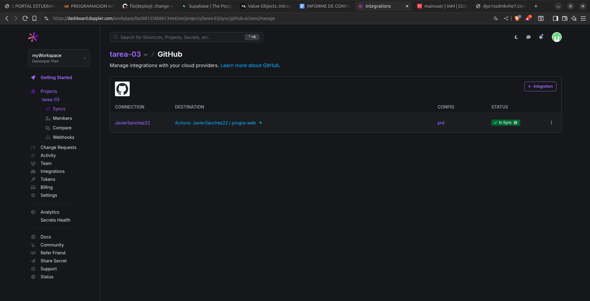
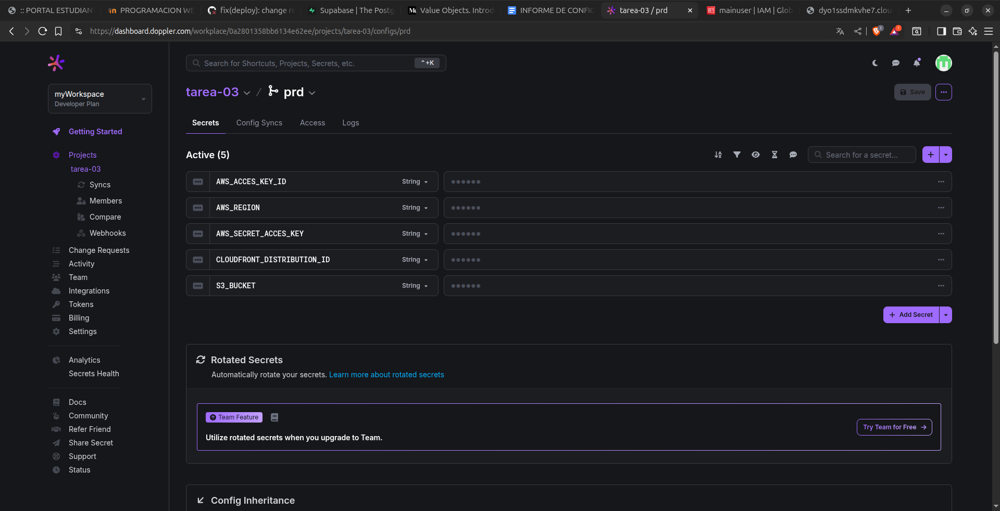
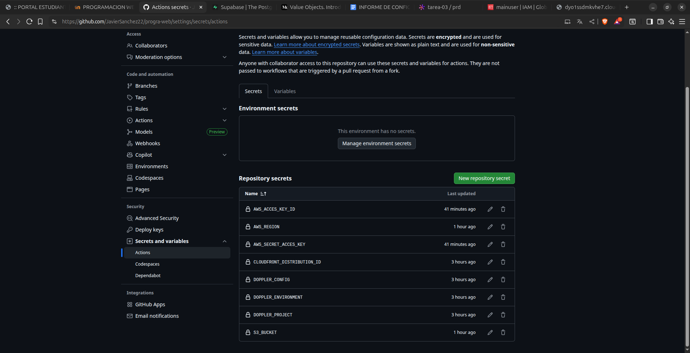
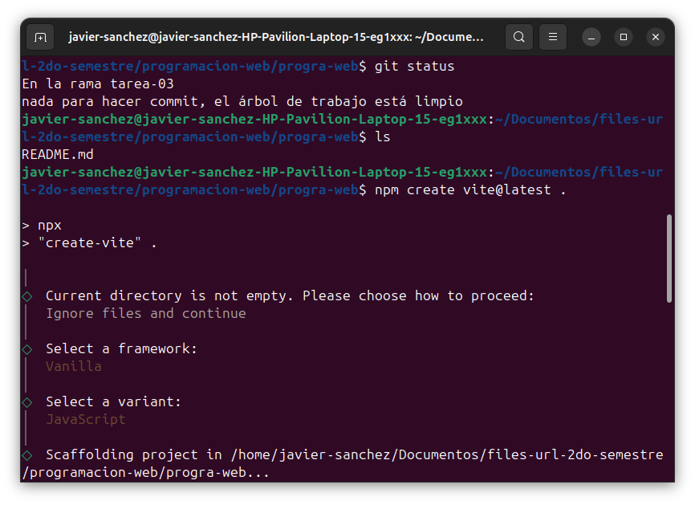
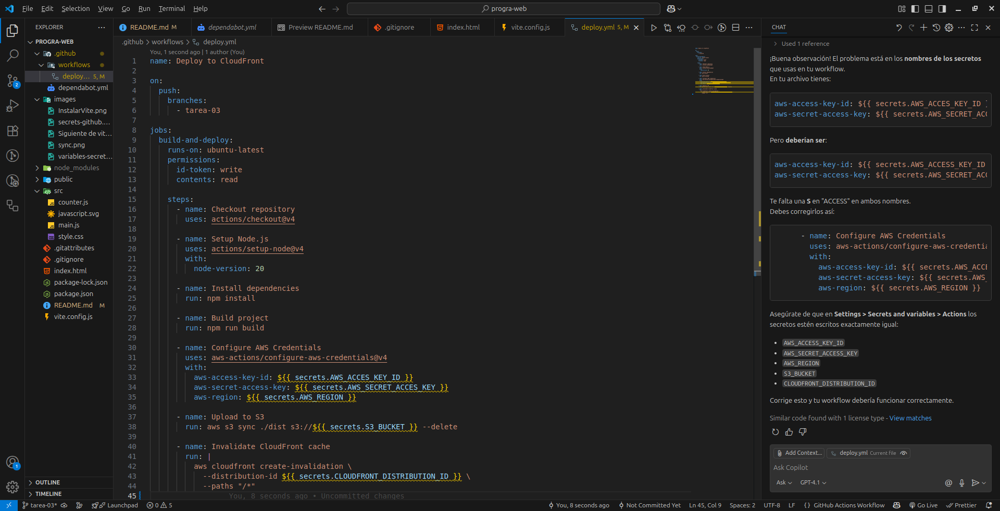

# Tarea 03 - Deployment a CDN

## Configuración

**Sincronización con GitHub**

**Variables en doppler**

**Secretos en GitHub**

**Creación de proyecto VITE**

**Github Actions**

## URL de CloudFront

URL: [Click aquí](https://dyo1ssdmkvhe7.cloudfront.net/index.html)
