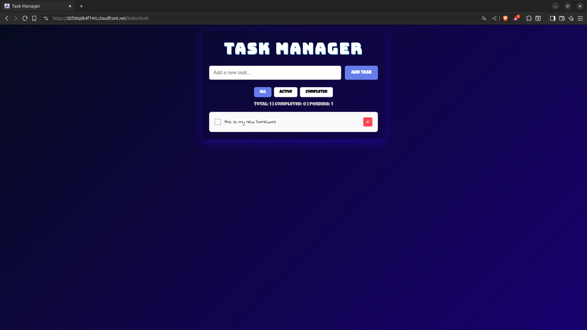

# **TASK MANAGER**


If you want to check out the **```TASK MANAGER```** application, [**Click Here**](https://d2fz9q0k4f74rt.cloudfront.net/index.html)
<br>



## Hooks used in this proyect:
### 1. useState:
Use state is a React Hook, that allows add state to functional components, this hook return an array with two elemts: the current state value and a function to update it
<br> 

**Why use it?**
* I used it for TaskForm, to handle the status of the name of the task the user is typing (taskName)
* In App to manage the status of the active filter
* And use in useLocalStorage to manage the status of the sotred value and the loading status

<br>

**Where use it? (example)**
```javascript
const [taskName, setTaskName] = useState('');
const [filter, setFilter] = useState('all');
```
### 2. useEffect:
useEffect is a React Hook that runs code after the component renders, allowing you to handle side effects like API calls, subscriptions, or resource cleanup.
<br> 

**Why use it?**
* I used it in useLocalStorage (two times), in load initial value and to save in localStorage

<br>

**Where use it? (example)**
```javascript
// Load value
useEffect(() => {
  const item = window.localStorage.getItem(key);
  if (item) {
    setStoredValue(JSON.parse(item));
  }
  setIsLoaded(true);
}, [key]);

// Save value
useEffect(() => {
  if (isLoaded) {
    window.localStorage.setItem(key, JSON.stringify(storedValue));
  }
}, [key, storedValue, isLoaded]);
```
### 3. Custom Hook, useLocalStorage
This Hook is my cutom Hook, to synchronize the state of React with the browser's local storage (localStorage) combinate with useState and useEffect
<br>

**Why use it?**
* Data persistance as tasks are maintained between user session
* Automatic Sync as each change in state is automatically saved to localStorage

<br>

**Where use it? (example)**
```javascript
import { useState, useEffect } from 'react';

function useLocalStorage(key, initialValue) {
  const [storedValue, setStoredValue] = useState(initialValue);
  const [isLoaded, setIsLoaded] = useState(false);

  // load from localStorage
  useEffect(() => {
    try {
      const item = window.localStorage.getItem(key);
      if (item !== null && item !== 'undefined' && item !== 'null') {
        const parsed = JSON.parse(item);
        setStoredValue(parsed);
      }
    } catch (error) {
      console.error('Error reading from localStorage:', error);
    } finally {
      setIsLoaded(true);
    }
  }, [key]);

  // save in local storage when change value
  useEffect(() => {
    if (isLoaded) {
      try {
        window.localStorage.setItem(key, JSON.stringify(storedValue));
      } catch (error) {
        console.error('Error saving to localStorage:', error);
      }
    }
  }, [key, storedValue, isLoaded]);

  return [storedValue, setStoredValue];
}
```

### 4. Hooks in main component
**HomeWork Status**
```javascript
const [tasks, setTasks] = useLocalStorage('tasks', []);
```
*task is a key under wich data is stored in localStorage and [] is a initial value if there is no previously save data*
<br><br>

**Filter Status**
```javascript
const [filter, setFilter] = useState('all');
```
*all is a initial value (show all tasks)*
