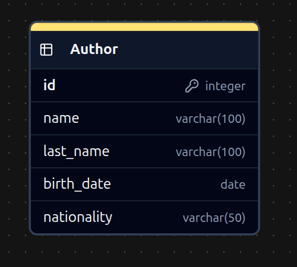
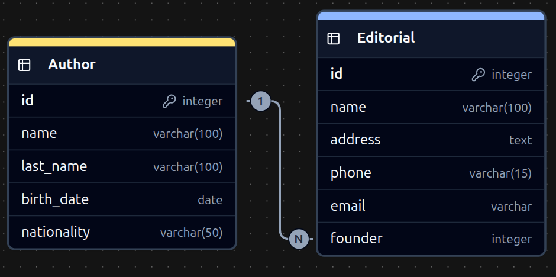
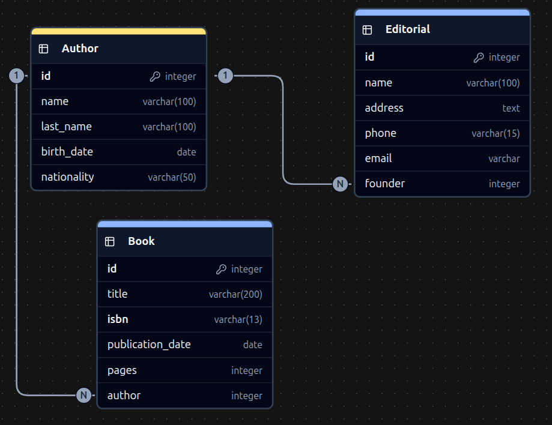
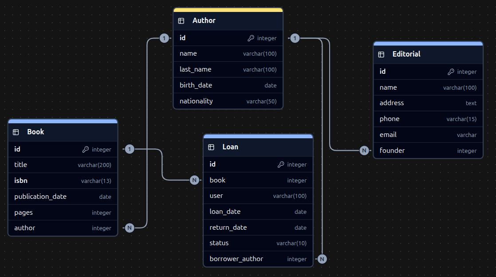

# **MIGRATIONS**

 

## **Description**
This proyect is made with Pyhton and Django to make migrations. This proyect consists of basic book loan management system, where authors, editorial, books, and loans made by users.

### **First model - Migration 1 (Author)**

_The first Author model was created, which represents authors with their basic personal data such as first name, last name, date of birth, and nationality_

### **Second model - Migration 2 (Editorial)**

_The Second Editorial model was added, linked to Author (First Model) by a foreign key in the founder field. This allows to record which autor founded each Editorial_

### **Third model - Migration 3 (Book)**

_The third Book model was added, linked to Author (First Model) by a foreign key in the author field. In this way, books written by an author can be registered_

### **Fourt model - Migration 4 (Loan)**

_Finally, the fourth model was created, which is related to Book and Author through foreign keys. This model represents book loans, indicating the user, loan and return dates, as well as the loan status_
