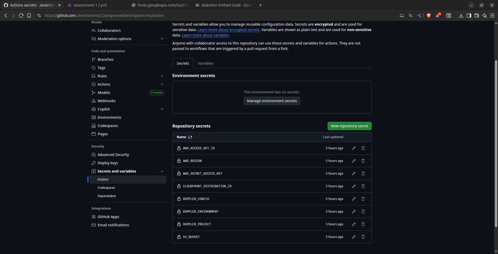

# Pokémon Cards

      

## Description

This repository is a Pokémon cards application with automated deployment and secrets management using **Doppler and AWS**.

### Doppler Config Syncs

*Doppler configuration showing sync integration with GitHub repository*

### Doppler Variables

*Environment variables configured in Doppler*

### GitHub Secrets Configuration

*Secrets configured in GitHub Actions for automated deployment*

### Pokémon Cards Application

*Application interface showing Pokémon cards*

## Live

**CloudFront CDN URL:** [Clic Here](http://dhe4its88jftp.cloudfront.net/index.html)

## Technologies Used

- HTML5
- CSS3
- JavaScript
- React
- AWS (S3 + CloudFront)
- GitHub Actions
- Doppler (Secrets Management)

## Autor
> Francisco Javier Sánchez Tasej - 2012421
